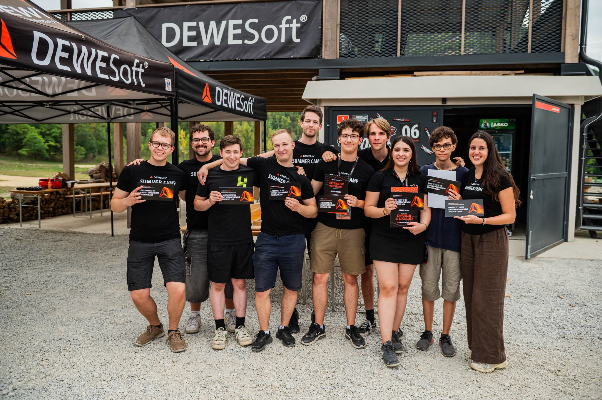

# Dewesoft Summer Camp 2026 — Project Overview

A hands-on team engineering project organized as a set of collaborative technical practical test-and-measurement challenges.  

The goal was to build and operate a **complete vehicle measurement setup** for instrumenting and testing a Mini Cooper (using professional data-acquisition hardware **Dewesoft Sirius** and **DewesoftX**).
There was combined: 
+ inertial navigation (IMU), 
+ CAN-bus data, 
+ strain-gauge hands-on application and measurement, 
+ acoustics measurement.

