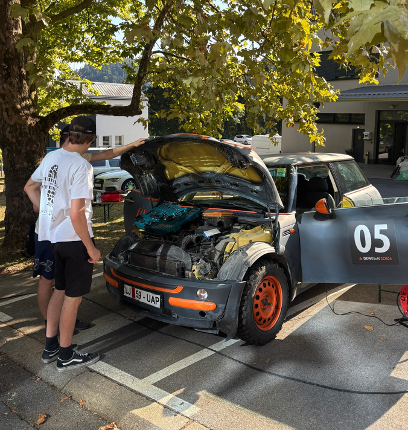

# Dewesoft Summer Camp 2026 — Project Overview

Click [HERE](https://dewesoft.com/) to get more info about Dewesoft company.
A hands-on team engineering project organized as a set of collaborative technical practical test-and-measurement challenges.  

The goal was to build and operate a **complete vehicle measurement setup** for instrumenting and testing a Mini Cooper (using professional data-acquisition hardware **Dewesoft Sirius** and **DewesoftX**).
There was combined: 
+ inertial navigation (IMU), 
+ CAN-bus data, 
+ strain-gauge hands-on application and measurement, 
+ acoustics measurement, etc.

The challenges are further described here:
+ [The setup of the inertial measurement unit](daq_setup.md)
+ [The acoustic analysis](acoustic_analysis.md)
+ [The strain gauge challenge](stg_analysis.md)
+ [Precision driving](precision_driving.md)
+ [CAN analysis](can.md)
+ [0-40-0 challenge](0_40_0.md)
